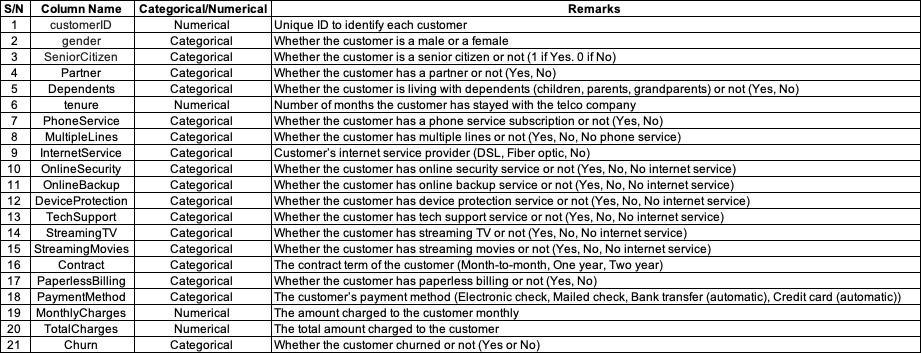
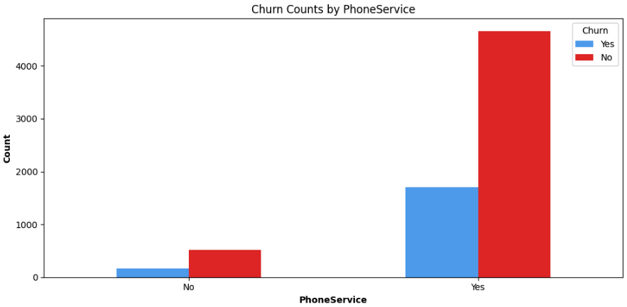

# SC1015 Project - Telco Customer Churn Prediction
This Project is Done By: Jonah Choon, Lee Jia Xuan, Lorayne Lim

 

## 1 - Table of Content
Problem Definition [[ReadMe.md](ReadMe.md)] \
Data Preparation & Data-Driven Insights [[Exploratory Data Analysis](Jupyter%20Notebooks/1%20-%20Exploratory%20Data%20Analysis%20(EDA).ipynb), [Machine Learning](Jupyter%20Notebooks/2%20-%20Machine%20Learning.ipynb), [Additional Machine Learning](Jupyter%20Notebooks/3%20-%20Additional%20Machine%20Learning%20(Logistic%20Regression,%20K%20Nearest%20Neighbours,%20Random%20Forest).ipynb)] \
Exploratory Data Analysis [[Exploratory Data Analysis](Jupyter%20Notebooks/1%20-%20Exploratory%20Data%20Analysis%20(EDA).ipynb)] \
Machine Learning (Binary Tree Classification) [[Machine Learning](Jupyter%20Notebooks/2%20-%20Machine%20Learning.ipynb)] \
Additional Machine Learning (Logistic Regression, K-Nearest Neighbours, Random Forest) [[Additional Machine Learning](Jupyter%20Notebooks/3%20-%20Additional%20Machine%20Learning%20(Logistic%20Regression,%20K%20Nearest%20Neighbours,%20Random%20Forest).ipynb)]

 

## 2 - Marking Rubrics
10% for coming up with your own problem definition based on a dataset \
10% for data preparation and cleaning to suit the problem of your choice \
20% for exploratory data analysis/visualization to gather relevant insights \
20% for the use of machine learning techniques to solve specific problem \
20% for the presentation of data-driven insights and the recommendations \
10% for the quality of your final team presentation and overall impressions \
10% for learning something new and doing something beyond this course 

 

## 3 - Problem Definition
## Problem Definition:
In the fast-changing telco industry, customer retention is a rising issuing issue as competing telcos offer more attractive deals to lure potential customers. Hence, we wish to understand why customers switch telco companies and aim to predict the likelihood of existing customers changing their telco provider so that telcos can implement changes to retain customers before it is too late. 

In today's fast-changing telecommunications industry, the battle for customer loyalty and retention has become increasingly fierce. Telcos are continually innovating and offering attractive deals to entice potential customers, leading to a growing concern around customer churn. Studies have shown acquiring a new customer can cost five to twenty-five times more than retaining an existing customer (Singh & Khan, 2018). Furthermore, increasing customer retention by 5% can increase profits from 25-95% (Gallo, 2014). Hence, high customer retention rates greatly impacts a telco's business. As the allure of competitive deals tempts customers to switch providers, it has become imperative to delve into the reasons behind this trend. Therefore, our aim is to uncover the motivations driving customers to switch telco companies and develop predictive models that can anticipate the likelihood of existing customers changing their provider. By gaining insights into these dynamics, telcos can proactively implement strategies to retain their customers before they consider switching.

## References
- Gallo, A. (2014, October 29). The Value of Keeping the Right Customers. Harvard Business Review. https://hbr.org/2014/10/the-value-of-keeping-the-right-customers
- Singh, R., & Khan, I. A. (2018). An approach to increase customer retention and loyalty in B2C world. International journal of scientific and research publications, 2(11) (ISSN: 2250-3153). http://www.ijsrp.org/research-paper-1112.php?rp=P11433

## 4 - Understanding the Dataset
The dataset we will be using is from an IBM Sample Dataset for Telco Customer Churn, available on Kaggle (https://www.kaggle.com/blastchar/telco-customer-churn).

The dataset features can be broadly categorized into Three sections: User Information, Services Information and Contract & Payment Information. Below is a summary of the features available in the `Telco_Customer_Churn.csv` dataset.

### 4.1 - User Information
- `customerID` (Numerical): Unique ID to identify each customer.
- `gender` (Categorical): The customer's gender (male or female).
- `SeniorCitizen` (Categorical): Whether the customer is a senior citizen or not (1 for Yes, 0 for No).
- `Partner` (Categorical): Whether the customer has a partner or not (Yes or No).
- `Dependents` (Categorical): Whether the customer is living with dependents (children, parents, grandparents) or not (Yes, No).
- `tenure` (Numerical): Number of months the customer has stayed with the telco company.
- `PhoneService` (Categorical): Whether the customer has a phone service subscription (Yes or No).

### 4.2 - Services Information
- `MultipleLines` (Categorical): Whether the customer has multiple lines or not (Yes, No, or No phone service).
- `InternetService` (Categorical): Customer's internet service provider (DSL, Fiber optic, or No internet service).
- `OnlineSecurity` (Categorical): Whether the customer has online security service or not (Yes, No, or No internet service).
- `OnlineBackup` (Categorical): Whether the customer has online backup service or not (Yes, No, or No internet service).
- `DeviceProtection` (Categorical): Whether the customer has device protection service or not (Yes, No, or No internet service).
- `TechSupport` (Categorical): Whether the customer has tech support service or not (Yes, No, or No internet service).
- `StreamingTV` (Categorical): Whether the customer has streaming TV service or not (Yes, No, or No internet service).
- `StreamingMovies` (Categorical): Whether the customer has streaming movies service or not (Yes, No, or No internet service).

### 4.3 - Contract and Payment Information
- `Contract` (Categorical): The contract term of the customer (Month-to-month, One year, Two year).
- `PaperlessBilling` (Categorical): Whether the customer has paperless billing or not (Yes, No).
- `PaymentMethod` (Categorical): The customer's payment method (Electronic check, Mailed check, Bank transfer (automatic), Credit card (automatic)).
- `MonthlyCharges` (Numerical): The total amount charged to the customer monthly.
- `TotalCharges` (Numerical): The total amount charged to the customer.

### 4.4 - Prediction Target
- `Churn` (Categorical): Whether the customer churned or not (Yes or No).

## 5 - Exploratory Data Analysis

### 5.1 - Data Preparation
In the data preparation phase of our project, we ensured that the dataset was primed for analysis by meticulously cleaning and pre-processing the data. Initially, we scoured the dataset for any null values that could skew our analysis and predictive modeling. These null entries were carefully removed to maintain the integrity of the dataset. Subsequently, we converted all categorical variables that were labeled 'Yes' or 'No' into a binary format, with '1' representing 'Yes' and '0' signifying 'No'. This binary transformation is a crucial step, as it simplifies the dataset for our machine learning algorithms, allowing them to more effectively discern patterns and relationships within the data.

#### 5.1.1 - Cleaning (Remove all NULL Values)

As there are 11 NULL Entries in TotalCharges, those will be removed from the dataset

#### 5.1.2 - Transformation (Converting Category to Numerical)

All the entries with Yes or No will be converted to 1 and 0 to facilitate easier data preparation

### 5.2 - Churn Data (Exploratory Data Analysis)
Comparing churn rates is essential for understanding the health of a customer base and identifying the efficacy of retention strategies. By analyzing churn, companies can pinpoint which aspects of their service or product are falling short, allocate resources to improve those areas, and tailor their customer engagement to prevent further losses. It also allows for benchmarking against industry standards, revealing a company's competitive standing and informing necessary changes to maintain market share. Ultimately, this comparison is a vital tool for business growth and customer satisfaction, as it not only exposes weaknesses but also highlights potential opportunities for improvement.

Moving into the exploratory data analysis (EDA) phase, our primary objective was to uncover the underlying relationships between categorical features and customer churn. To achieve this, we systematically compared each categorical variable against churn, our target variable. By employing visualization like bar charts, we could vividly depict the proportion of churn within each category.
<table>
  <tr>
    <td></td>
    <td></td>
    <td></td>
  </tr>
  <tr>
    <td></td>
    <td></td>
    <td></td>
  </tr>
  <tr>
    <td></td>
    <td></td>
    <td></td>
  </tr>
  <tr>
    <td></td>
    <td></td>
    <td></td>
  </tr>
  <tr>
    <td></td>
    <td></td>
    <td></td>
  </tr>
  <tr>
    <td></td>
    <td></td>
    <td></td>
  </tr>
  <tr>
    <td></td>
    <td></td>
    <td></td>
  </tr>
  <tr>
    <td></td>
    <td></td>
    <td></td>
  </tr>
  <tr>
    <td></td>
    <td></td>
    <td></td>
  </tr>
</table>

<table>
  <tr>
    <td></td>
    <td></td>
  </tr>
  <tr>
    <td></td>
    <td></td>
  </tr>
  <tr>
    <td></td>
    <td></td>
  </tr>
</table>
Examining the bar charts reveals that certain categories are significantly impacted by customer churn. Most notably, the use of electronic checks as a payment method is linked to the highest churn rate, indicating a potential source of customer dissatisfaction or inconvenience. Furthermore, customers with month-to-month contracts leave at a much higher rate than those with longer-term contracts, indicating potential issues with short-term customer commitment or satisfaction. Subscribers to fiber optic internet services are also churning at higher rates, possibly due to unmet expectations or competing offerings. Furthermore, churn rates rise in the higher monthly charge bracket, indicating price sensitivity or a perceived lack of value among these customers.Finally, the tenure group from 0 to 12 months has significantly higher churn, which could indicate a critical early customer experience that fails to foster loyalty. These findings suggest that targeted strategies could be developed to address specific challenges in these categories, thereby improving overall customer retention.

### 5.3 - Further Analysis of the Numeric Values (Tenure, MonthlyCharges & TotalCharges)

Further analysis of the numeric values for tenure, monthly charges, and total charges was necessary to understand the nuanced patterns of churn, such as the likelihood of churn based on customer loyalty over time, sensitivity to pricing, and overall expenditure, which are not apparent from categorical comparisons alone.

### 5.4 - Checking the Outliers of the data (Tenure, MonthlyCharges & TotalCharges)

Outliers, as depicted in these box plots for tenure, monthly charges, and total charges, are data points that deviate significantly from the majority of the data, potentially indicating variability in a customer's experience or behavior. Addressing outliers is crucial because they can skew the analysis, leading to misinterpretation of trends and the efficacy of business strategies. By examining and refining these outliers, analysts ensure a more accurate and robust model that truly reflects the customer base and identifies the underlying patterns and relationships in the data. 

### 5.5 - Correlation to Churn with other Category 
<table>
  <tr>
    <td></td>
    <td></td>
  </tr>
</table>

Analyzing the correlation between different features and churn allows us to understand which aspects of the service or customer demographics are most likely to influence a customer's decision to leave. This type of analysis helps in prioritizing which areas require attention for improving customer retention. 

In analyzing customer churn, I've decided to concentrate on characteristics that show a correlation coefficient greater than 0.25 with churn, as indicated by the correlation chart. These characteristics, which all share a positive correlation with churn, are likely to be significant indicators of churn risk. By focusing on these, I aim to identify strong predictors that could be key targets for interventions to reduce churn.

Conversely, features with correlation coefficients less than 0.25 exhibit a mix of positive and negative relationships with churn and will be excluded from this phase of analysis. While these attributes may still influence churn, their effects are likely more subtle and may require complex modeling to decipher their true impact on customer retention. This approach allows for a more streamlined and focused analysis on the most influential factors driving churn.

### 5.6 - Summary on Exploratory Data Analysis:
The EDA phase has set the stage by identifying key factors that significantly correlate with customer churn. With these insights in hand, machine learning will take over to further dissect and quantify these relationships. Leveraging sophisticated algorithms, the machine learning process will aim to build predictive models that can accurately forecast the likelihood of churn for individual customers.

The transition from EDA to machine learning represents a shift from hypothesis-driven analysis to prediction-based modeling. By feeding the refined dataset—highlighted by strong predictors of churn—into various machine learning models, we'll be able to validate the initial findings and potentially unveil more complex patterns that EDA alone could not decipher. Machine learning's ability to handle vast amounts of data and learn from it means that not only will it corroborate the findings from EDA, but it will also enhance them, providing a more nuanced understanding of customer behavior.

This integration of EDA findings into machine learning models ensures a data-driven approach to solving the churn problem, enhancing the company's ability to act preemptively to retain customers. The predictive power of machine learning, coupled with the groundwork laid by the EDA, promises a significant step forward in customer retention strategy.

## 6 - Machine Learning

### 6.1 - Data Preparation
From EDA, we found that there is a class imbalance among the churn rate, with more customers with no churn dominating the dataset. To prevent the machine learning model from being biased/inaccurate, I downsampled and shuffled the data such that the amount of churn is now equal.

The train & test data are randomly selected at a ratio of 80% to 20%. This split dataset is used for all Binary Tree Classifications.

### 6.2 - Determining variables used for comparison
I have plotted a correlation graph to identify top 3 variables that are positively and negatively related to Churn. The variables identified will be used to carry out comparison with Churn using Binary Tree Classification to sieve out the variable that is most accurate in predicting Churn. 

The `top 3` variables that is `positively related` to Churn:
1. Contract_Month-to-month
2. OnlineSecurity_No
3. TechSupport_No

The `top 3` variables that is `negatively related` to Churn:
1. tenure
2. Contract_Two year
3. OnlineBackup_No internet service

**Therefore, we will be using `Contract`, `Tenure`, `OnlineSecurity`, `OnlineBackup` and `TechSupport` to predict Churn.**

### 6.3 - Binary Tree Classification (variables based on correlation graph)
The logic I used to decide which specific factor in the variable is the most important in predicting Churn is:
- The lower the Gini Index, the more confident the node is in predicting "Churn".
- The more the drop in Gini from a parent node to the children node, the better is the split. The tree automatically decides the best variables by splitting the tree using them.
- Thus, the higher the variable occurs in a tree, the more important it is.

These are the output of the model based on train & test data. 

#### 6.3.1 - Contract VS Churn
<table>
  <tr>
    <td></td>
    <td></td>
  </tr>
</table>

`Contract_Month-to-month` is the most important in predicting "Churn" as compared to Contract_One year and Contract_Two year as it occurs in the very first split of the tree and leads to the greatest drop in Gini as seen from the children node where gini = 0.279, a drop of 0.221 as compared to the parent node with Gini = 0.5.

#### 6.3.2 - Tenure VS Churn
<table>
  <tr>
    <td></td>
    <td></td>
  </tr>
</table>

`Tenure Group_0-12` is the most important in predicting "Churn" as compared to the other groups in Tenure as it occurs in the very first split of the tree and leads to the greatest improvement in Gini as seen from the children node where gini = 0.391 is the lowest amongst all leaf nodes.

#### 6.3.2 - OnlineSecurity VS Churn
<table>
  <tr>
    <td></td>
    <td></td>
  </tr>
</table>

`OnlineSecurity_No` is the most important in predicting "Churn" as compared to the other groups in OnlineSecurity as it occurs in the very first split of the tree and leads to the greatest drop in Gini as seen from the children node where gini = 0.4, a drop of 0.1 as compared to the parent node with Gini = 0.5.

#### 6.3.3 - OnlineBackup VS Churn
<table>
  <tr>
    <td></td>
    <td></td>
  </tr>
</table>

`OnlineBackup_No internet service` is the most important in predicting "Churn" as compared to the other groups in OnlineBackup as it occurs right after the first split of the tree and leads to the greatest drop in Gini as seen from the children node where gini = 0.31, a drop of 0.147 as compared to the parent node with Gini = 0.457.

#### 6.3.4 - TechSupport VS Churn
<table>
  <tr>
    <td></td>
    <td></td>
  </tr>
</table>

`TechSupport_No` is the most important in predicting "Churn" as compared to the other groups in TechSupport as it occurs in the very first split of the tree and leads to the greatest drop in Gini as seen from the children node where gini = 0.386, a drop of 0.114 as compared to the parent node with Gini = 0.5.

### 6.4 - Analysis of data
**Contract VS Churn**         
Classification Accuracy 	: 0.7473262032085561     
True Positive Rate 	    : 0.8976982097186701     
False Positive Rate 	: 0.4173669467787115

**Tenure VS Churn**        
Classification Accuracy 	: 0.6751336898395722     
True Positive Rate 	    : 0.6929347826086957     
False Positive Rate 	: 0.34210526315789475

**OnlineSecurity VS Churn**       
Classification Accuracy 	: 0.6737967914438503     
True Positive Rate 	    : 0.7871148459383753     
False Positive Rate 	: 0.429667519181585

**OnlineBackup VS Churn**        
Classification Accuracy 	: 0.6590909090909091     
True Positive Rate 	    : 0.6519337016574586     
False Positive Rate 	: 0.33419689119170987

**TechSupport VS Churn**       
Classification Accuracy 	: 0.6550802139037433     
True Positive Rate 	    : 0.7409326424870466     
False Positive Rate 	: 0.43646408839779005

**Conclusion:** Combining the results of the classification tree, classification accuracy and confusion matric, Contract_Month-to-month is the most accurate in predicting whether a customer "Churns", followed by Contract_Two year. The model used to predict "Churn" by using Contract as predictors has the highest classification accuracy and the highest True Positive Rate among the other categorical variables used to predict "Churn". The model also has a relatively low False Positive Rate. Hence, `Contract_Month-to-month` is the most accurate in predicting whether a customer "Churns", followed by `Contract_Two year`.

### 6.5 - Binary Tree Classification (All variables from downsampled data VS Churn)
I have made another comparison between Churn and all the variables available in the downsampled data, excluding Churn. The purpose of this comparison is to determine whether if using the correlation graph is better in narrowing down the scope and identifying which variable is most accurate in predicting Churn. 

These are the output of the model based on train & test data. 

**All variables VS Churn**     
Classification Accuracy 	: 0.7232620320855615     
True Positive Rate 	: 0.712468193384224     
False Positive Rate 	: 0.2647887323943662     

### 6.6. Summary on the 2 Binary Tree Classification Models
Although the classification accuracy for the model for comparison between all variables and Churn is slightly higher than most models built based on the top 5 most correlated variables to Churn, as seen in the Correlation graph, the Binary Tree (All variables from downsampled data VS Churn) is much more complicated when comparing the individual variables to Churn, thus harder to sieve out the important variables to predict Churn. 

Furthermore, the classification accuracy for Contract, the model that is most accurate in predicting Churn based on the conclusion made in: 3. Binary Tree Classification (variables based on correlation graph) - Analysis of data, is higher than that of Binary Tree Classification (All variables from downsampled data VS Churn). Hence, models built based on the correlated graph is better in predicting which variables are accurate in predicting Churn.

## 7 - Additional Machine Learning

### 7.1 - Data Preparation
From EDA, we found that there is a class imbalance among the churn rate, with more customers with no churn dominating the dataset. To prevent the machine learning model from being biased/inaccurate, I downsampled and shuffled the data such that the amount of churn is now equal.

The train & test data are randomly selected at a ratio of 75% to 25%. This split dataset is used for all 3 machine learning models.

### 7.2 - Logistic Regression
These are the output of the model based on train & test data.
<table>
  <tr>
    <td></td>
    <td></td>
  </tr>
</table>

**Top & Bottom 10 Weights:** \

**Accuracy Metrics:** \
`Accuracy: 0.7593582887700535`\
`Precision: 0.7587548638132295`\
`Recall: 0.7942973523421588`\
`F1 Score: 0.7761194029850746`\
`Log Loss: 0.5052839502019649`\
`ROC AUC: 0.8339525880259078`

**Accuracy (~0.78):** This is the proportion of true results (both true positives and true negatives) among the total number of cases examined. An accuracy of approximately 77% means that the model correctly predicts the outcome 77% of the time, which is generally good.

**Precision (~0.78):** Precision is the ratio of true positives to the sum of true and false positives. It indicates the quality of the positive class predictions. A precision of 77% means that when the model predicts the positive class, it is correct about two-thirds of the time. This is decent but suggests some room for improvement in reducing false positives.

**Recall (~0.8):** Recall, or sensitivity, measures the proportion of actual positives that are correctly identified. A recall of 80% means the model identifies 80% of all actual positive cases.

**F1 Score (~0.79):** The F1 score is the harmonic mean of precision and recall, providing a single metric to assess the balance between them. An F1 score of 60% is moderate, indicating that there is a balance but also room for improvement in both precision and recall.

**Log Loss (~0.48):** Log loss measures the performance of a classification model where the prediction is a probability value between 0 and 1. A lower log loss indicates a better model. A log loss of about 0.48 means that, on average, the model's probability estimates are fairly well-calibrated.

**ROC AUC (~0.85):** The Area Under the Receiver Operating Characteristic Curve (ROC AUC) measures the ability of a model to distinguish between classes. An AUC of 0.85 is quite good, indicating a high level of separability, meaning the model is well capable of distinguishing between the positive and negative classes.

**Conclusion**
These values suggest that the model performs reasonably well in general terms. It has a high ROC AUC score, suggesting good discriminative ability, and a fair balance between precision and recall as reflected in the F1 score. The accuracy is also relatively high. The log loss indicates how closely the probability predictions of the model match the actual outcomes.

### 7.3 - K-Nearest Neighbours
K-Nearest Neighbors (KNN) is a simple and versatile supervised machine learning algorithm for both classification and regression. Each feature in the input data represents one dimension in an n-dimensional feature space.

When a new (test) data point needs to be classified, KNN calculates the distance from this new point to all other points in the training dataset. After calculating the distances, the algorithm sorts these distances and determines the nearest 'k' data points — these are the 'K-Nearest Neighbors'

These are the output of the model based on train & test data.
<table>
  <tr>
    <td></td>
    <td></td>
  </tr>
</table>

**Accuracy Metrics:**\
`Accuracy: 0.7155080213903743`\
`Precision: 0.7049180327868853`\
`Recall: 0.7881873727087576`\
`F1 Score: 0.7442307692307694`\
`Log Loss: 2.1274260218784002`\
`ROC AUC: 0.7778481128786627`

### 7.4 - Random Forest
Random Forest is an ensemble machine learning algorithm that combines multiple decision trees to improve prediction accuracy and avoid overfitting. It is used for both classification and regression tasks.

Random Forest leverages the power of multiple decision trees (an "ensemble"), which are trained on different parts of the same training set. By averaging the predictions of these trees or using a majority voting system, it produces a more accurate and stable prediction than any individual tree could.

These are the output of the model based on train & test data.
<table>
  <tr>
    <td></td>
    <td></td>
  </tr>
</table>

**Top & Bottom 10 Weights:** \

**Accuracy Metrics:**\
`Accuracy: 0.774331550802139`\
`Precision: 0.7692307692307693`\
`Recall: 0.814663951120163`\
`F1 Score: 0.7912957467853612`\
`Log Loss: 0.49762968802004315`\
`ROC AUC: 0.8421450982550779`

### 7.5 - Summary on the 3 Machine Learning Models
Taking each model's accuracy metrics (Accuracy, Precision, Recall, F1 Score, Log Loss, ROC AUC) into consideration, `K-Nearest Neighbours` is the worst performing model out of the 3.

`Logistic Regression` is slightly better than Random Forest with better accuracy metrics score overall. Hence, `Logistic Regression` may be an effective model to help the telco company in predicting future customer churn based on existing data.

Also, the Top & Bottom 3 weights identified by the `Logistic Regression` Model will be useful for the telco company to understand the profile of customers who churn. 

**Top 3 Most Positive Weights:**
1) TotalCharges
2) Contract_Month-to-month
3) InternetService_Fiber optic

**Top 3 Most Negative Weights:**
1) Tenure
2) Contract_Two year
3) InternetService_DSL

 

## 8 - Recommendation
### 8.1 - Machine Learning
Based on our classification tree, It is recommended for telco companies to offer discount to customer who choose a two year contract as it has a negative relation with Churn and is fairly accurate in predicting Churn. Discount can also be offered to those who choose one year contract so more customers will be bound by the contract.

In the mean time, in order to increase their customer retention level, companies can include features such as online backup and online security.

Lastly, it was no surprise that contract term is most accurate in predicting Churn as this signifies this measures customer loyalty. Having a short contract term will provide them with the greatest convenience to change telco companies whenever a more attractive contract is shown to them.

Companies can add in a time series to track the customer's information over time so as to increase the accuracy of the prediction and helping companies make more informed decisions and improve their business model. 

 

### 8.2 - Additional Machine Learning
Use our Logistic Regression model to help predict the likelihood of customer churn based on current data. The Telco Company may consider giving vouchers or rebates to retain high-risk customers who are likely to churn.

Also, the Telco Company should compare the following areas against other Telco Companies and aim to provide more attractive deals at competitive pricing:
1) Monthly Charges
2) Month-to-Month Contracts
3) Fiber Optic Internet Services

This is because these were the top metrics associated with customers who churn, meaning the Telco Company is losing out to its competitors.

On the other hand, they should also note that they are doing very well in the following areas:
1) Long Customer Tenure
2) Two Year Contracts
3) DSL Internet Services

### 8.3 Overall Recommendation:
In conclusion, leveraging our Linear Regression model together with our classification tree empowers companies to accurately predict the  variables within a contract that significantly influence customer contract renewals. By analyzing their extensive customer database and corresponding contracts, companies can pinpoint these crucial variables. It is vital for companies to strike a balance between a variable's importance in preventing customer churn (as determined by Linear Regression) and its accuracy in predicting churn (as assessed by the classification tree). Additionally, this approach offers valuable insights into areas for contract improvement, guiding companies on how and where to refine their offers to achieved higher customer satisfaction and retention.

## 9 - Reflection 
### 9.1 - Jonah 
This project enhanced my understanding of data analysis by bridging classroom theory and applying it to our project. Navigating through large datasets to identify characteristics influencing client retention was both difficult and enjoyable. It emphasized the importance of initiatives based on data in increasing corporate competitiveness and operational efficiency. This experience not only improved my analytical skills, but also sparked my curiosity in the real-world implications of data science.

### 9.2 - Jia Xuan
The project was more challenging than expected as it was much more in-depth compared to our lab sessions. Having a macro-to-micro view of the dataset allows us to understand the nuances of how each datatype influences customer churn. Our project demonstrates how data science can help businesses understand how to perform better in a competitive market, backed by quantitative data and logical reasoning.

### 9.3 - Lorayne 
This project has provided me with the opportunity to delve deeper into the telco industry and the features that customers look out for before signing a contract. I also have a deeper understanding of our these telco companies work. This project has allowed me to apply the various techniques taught to us to extract useful insights from the large volumes of data. From there, we can discover meaningful patterns and useful insights to support decision-making in the business world.

