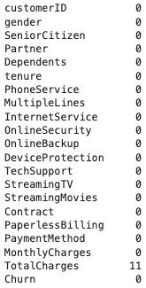

# SC1015 Project - Telco Customer Churn Prediction
This Project is Done By: Jonah Choon, Lee Jia Xuan, Lorayne Lim

 

## 1 - Table of Content
- Problem Definition [[readme.md](readme.md)]
- Data Preparation & Data-Driven Insights [[Exploratory Data Analysis](Jupyter%20Notebooks/1%20-%20Exploratory%20Data%20Analysis%20(EDA).ipynb), [Machine Learning](Jupyter%20Notebooks/2%20-%20Machine%20Learning.ipynb), [Additional Machine Learning](Jupyter%20Notebooks/3%20-%20Additional%20Machine%20Learning%20(Logistic%20Regression,%20K%20Nearest%20Neighbours,%20Random%20Forest).ipynb)]
- Exploratory Data Analysis [[Exploratory Data Analysis](Jupyter%20Notebooks/1%20-%20Exploratory%20Data%20Analysis%20(EDA).ipynb)]
- Machine Learning (Binary Tree Classification) [[Machine Learning](Jupyter%20Notebooks/2%20-%20Machine%20Learning.ipynb)]
- Additional Machine Learning (Logistic Regression, K-Nearest Neighbours, Random Forest) [[Additional Machine Learning](Jupyter%20Notebooks/3%20-%20Additional%20Machine%20Learning%20(Logistic%20Regression,%20K%20Nearest%20Neighbours,%20Random%20Forest).ipynb)]
- Recommendation
- What We Learnt
- Group Report [[Project Walkthrough.md](Project%20Walkthrough.md)]

## 2 - Problem Definition
In the fast-changing telco industry, customer retention is a rising issuing issue as competing telcos offer more attractive deals to lure potential customers. Hence, we wish to understand why customers switch telco companies and aim to predict the likelihood of existing customers changing their telco provider so that telcos can implement changes to retain customers before it is too late. 

In today's fast-changing telecommunications industry, the battle for customer loyalty and retention has become increasingly fierce. Telcos are continually innovating and offering attractive deals to entice potential customers, leading to a growing concern around customer churn. Studies have shown acquiring a new customer can cost five to twenty-five times more than retaining an existing customer (Singh & Khan, 2018). Furthermore, increasing customer retention by 5% can increase profits from 25-95% (Gallo, 2014). Hence, high customer retention rates greatly impacts a telco's business. As the allure of competitive deals tempts customers to switch providers, it has become imperative to delve into the reasons behind this trend. Therefore, our aim is to uncover the motivations driving customers to switch telco companies and develop predictive models that can anticipate the likelihood of existing customers changing their provider. By gaining insights into these dynamics, telcos can proactively implement strategies to retain their customers before they consider switching.

## References
- Gallo, A. (2014, October 29). The Value of Keeping the Right Customers. Harvard Business Review. https://hbr.org/2014/10/the-value-of-keeping-the-right-customers
- Singh, R., & Khan, I. A. (2018). An approach to increase customer retention and loyalty in B2C world. International journal of scientific and research publications, 2(11) (ISSN: 2250-3153). http://www.ijsrp.org/research-paper-1112.php?rp=P11433

## 3 - Machine Learning Models Used:
- Binary Classification Tree
- Logical Regression
- K-Nearest Neighbours
- Random Forest 

## 4 - Understanding the Dataset
The dataset we will be using is from an IBM Sample Dataset for Telco Customer Churn, available on Kaggle (https://www.kaggle.com/blastchar/telco-customer-churn).

The dataset features can be broadly categorized into Three sections: User Information, Services Information and Contract & Payment Information. Below is a summary of the features available in the `Telco_Customer_Churn.csv` dataset.

There are 4 groups of information present:
1) Customer Information
2) Services Data
3) Contract and Payment Data
4) Churn Status

### 5.1 - Data Preparation
In the data preparation phase of our project, we ensured that the dataset was primed for analysis by meticulously cleaning and pre-processing the data. Initially, we scoured the dataset for any null values that could skew our analysis and predictive modeling. These null entries were carefully removed to maintain the integrity of the dataset. Subsequently, we converted all categorical variables that were labeled 'Yes' or 'No' into a binary format, with '1' representing 'Yes' and '0' signifying 'No'. This binary transformation is a crucial step, as it simplifies the dataset for our machine learning algorithms, allowing them to more effectively discern patterns and relationships within the data.

#### 5.1.1 - Cleaning (Remove all NULL Values)

As there are 11 NULL Entries in TotalCharges, those will be removed from the dataset

***************************************** Remaining portions to compress actions & findings in point form

## 6 - Machine Learning
This ML model aims to identify which variables are most accurate in predicting whether a customer Churns. These variables are selected based on two aspects:

- Comparison 1: The top 3 variables that show the strongest positive and negative correlations with churn (based on Correlation graph)
- Comparison 2: All variables (based on Downsampled dataset)

Despite having similar classification accuracy in both scenarios, the model that incorporates all variables from the downsampled data is considered weaker due to its complexity in data visualization, which makes it challenging to isolate the essential variables for churn prediction. Therefore, classification trees which uses the variables' rankings in the correlation graph is more suitable in identifying a variable's accuracy in predicting whether a customer Churns.

## 7 - Additional Machine Learning
The following additional Machine Learning models were trained on train (75%) and test (25%) data:
- Logistical Regression
- K-Nearest Neighbours
- Random Forest

Each model's Confusion Matrix, ROC Curve and other accuracy metrics such as Accuracy, Precision, Recall, F1 Score, Log Loss and ROC AUC were computed.

Taking the accuracy metrics into consideration, Logistic Regression was the most accurate model, closely followed by Random Forest and K-Nearest Neighbours in last place.

The Top and Bottom 3 weights identified by the Logistic Regression Model will be useful for the telco company to understand the profile of customers who churn.

## 8 - Recommendation
In conclusion, leveraging our Linear Regression model together with our Classification Tree empowers companies to accurately predict the variables within a contract that significantly influence customer contract renewals. By analyzing their extensive customer database and corresponding contracts, companies can pinpoint these crucial variables. Companies need to strike a balance between a variable's importance in preventing customer churn (as determined by Linear Regression) and its accuracy in predicting churn (as assessed by the classification tree). Additionally, this approach offers valuable insights into areas for contract improvement, guiding companies on how and where to refine their offers to achieve higher customer satisfaction and retention.

## 9 - What We Learnt
- A macro-to-micro view of the dataset allows us to understand how each datatype influences churn​
- Using different ML models​
- Connecting theoretical concepts from the classroom with practical application in our project

## 10 - Contributors
- Problem Definition (All)
- Exploratory Data Analysis (Jonah)
- Machine Learning [Binary Classification Tree] (Lorayne)
- Machine Learning [Logistic Regression, K-Nearest Neighbours, Random Forest] (Jia Xuan)
- Recommendations (Lorayne & Jia Xuan)
- What We Learnt/Reflection (All)
- File Management and Formatting (Jonah)
- Video Editing (Jia Xuan)
